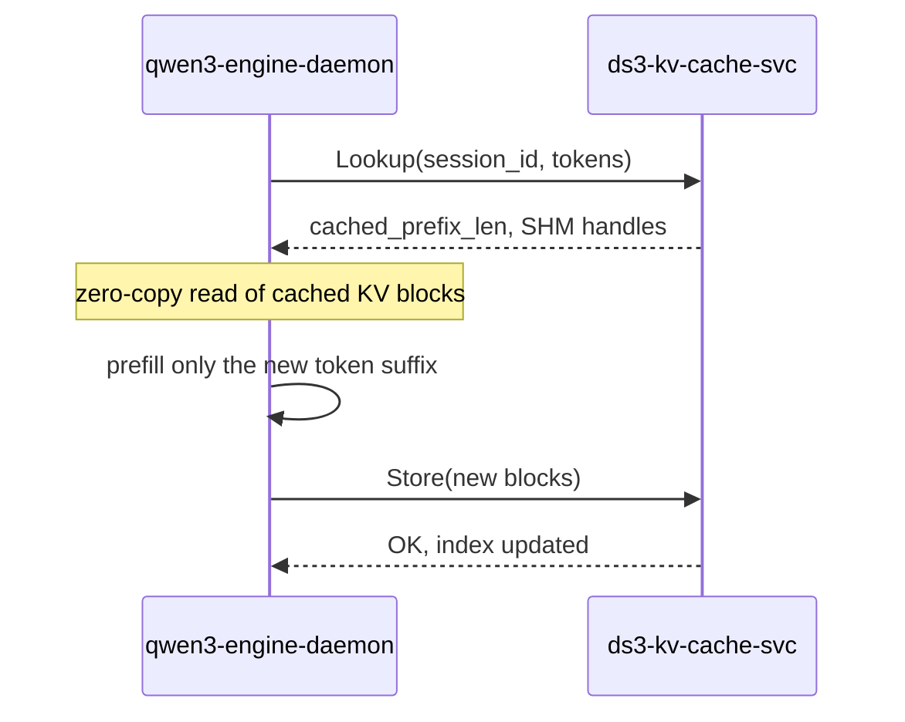
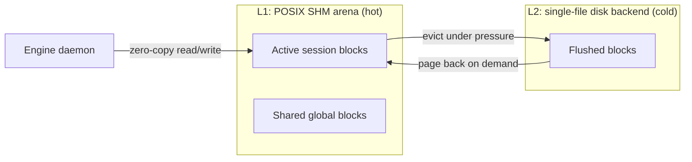

# Introducing `ds3-kv-cache-svc`: A Fast, Local KV Cache for LLM Inference

> **TL;DR:** We open-sourced [`ds3-kv-cache-svc`](https://github.com/wzqhbustb/kv_cache), a Rust-based KV cache service for local LLM inference. It uses radix-tree prefix matching, POSIX shared-memory zero-copy transfers, and an optional tiered L1/L2 backend to cut redundant prefill work. In a real multi-turn agent benchmark it speeds up generation by **2.0–2.5x**. It is dual-licensed under MIT/Apache-2.0. Read on to learn why we built it and how it works — or [star the repo](https://github.com/wzqhbustb/kv_cache) if you want to follow along.

---

## The hidden cost of repeating yourself to an LLM

Every time you send a prompt to a large language model, the engine has to do two things:

1. **Prefill** — run the transformer over every token in the prompt to build the key/value (KV) cache.
2. **Decode** — generate new tokens one at a time, attending to that KV cache.

Prefill is expensive, and in many real applications we pay for it over and over again. A coding assistant re-reads the entire file history on every turn. A chatbot reprocesses the system prompt and previous conversation. A multi-agent system runs the same long context through the model again and again. If the prompt is 4,000 tokens long, the engine may do more work *re-reading the prompt* than generating the actual answer. In our own tests, re-processing those 4,000 tokens can cost **8+ seconds per turn** before a single new token is generated.

The obvious fix is to cache the KV tensors from previous turns and reuse them. Cloud inference stacks like vLLM and TGI already do this, but they are built for data-center deployment: multi-GPU, multi-node, scheduler-heavy. What if you are running a large model on a single machine — maybe a MacBook Pro with 48 GB of RAM and an Apple Silicon GPU — and want several local agents to share the same cache?

That is the gap `ds3-kv-cache-svc` is designed to fill.

It is also the KV-cache infrastructure we built for our own local agent system, `qw3-agent` — a real, multi-turn coding assistant that runs large models on a single machine. We are open-sourcing the service because the problem is general: any local engine that handles repeated or partially-shared prompts can benefit from the same layer.

---

## What is `ds3-kv-cache-svc`?

`ds3-kv-cache-svc` is a **local, multi-process KV cache service** written in Rust. It sits between one or more engine daemons and the host memory/disk, caching per-token KV tensors so that repeated or partially-shared prompts can skip redundant prefill work.

We chose Rust for this layer because it gives us memory safety without a garbage collector, zero-cost abstractions for the hot paths, and a strong ecosystem for systems I/O and concurrency — all important for a long-running service that manipulates shared memory and serves multiple engine processes.

Key characteristics:

- **Unix Domain Socket (UDS) control plane** — simple, low-latency RPC for `CreateSession`, `Lookup`, `Allocate`, `Store`, and `Heartbeat`.
- **POSIX shared memory (SHM) data plane** — hot KV blocks live in `shm_open` arenas. Engine daemons read cached blocks directly from SHM, and write newly allocated blocks directly into the same arena before telling the service to `Store` them. No socket or file copies in either direction.
- **Radix-tree prefix index** — caches are keyed by token sequences, enabling longest-common-prefix reuse.
- **Tiered storage** — L1 SHM for hot data, L2 disk for persistence and large capacity.
- **Engine-agnostic protobuf API** — any inference engine can connect by implementing a small provider/adapter.

It is not a drop-in replacement for vLLM or TGI; it is a specialized building block for **single-machine, multi-process inference** where low overhead and shareability matter more than distributed scale.

---

## Why a separate service instead of embedding the cache in the engine?

We started with the cache inside a single engine daemon. That works, but it quickly becomes limiting:

- **One daemon, one cache.** If you run two agents, each with its own daemon, they cannot share a cached system prompt or conversation history.
- **Cache dies with the process.** Restart the daemon and the KV state is gone.
- **Memory fragmentation.** Every daemon manages its own arena; over time you end up with many duplicated blocks.

A standalone service solves all three. Multiple daemons connect over UDS, share global blocks through SHM, and persist state to disk. Each engine only needs to know how to ask for cached prefixes and how to write new KV tensors back.

---

## Architecture at a glance

```text
┌─────────────────┐     ┌─────────────────┐
│  qw3-agent A    │     │  qw3-agent B    │
└────────┬────────┘     └────────┬────────┘
         │                       │
         ▼                       ▼
┌─────────────────────────┐   ┌─────────────────────────┐
│ qwen3-engine-daemon     │   │ qwen3-engine-daemon     │
│ (C provider / client)   │   │ (C provider / client)   │
└────────┬────────────────┘   └────────┬────────────────┘
         │  UDS control plane          │
         └───────────┬─────────────────┘
                     ▼
         ┌───────────────────────┐
         │ ds3-kv-cache-svc      │
         │ (Rust service)        │
         │  - Radix tree index   │
         │  - Block store        │
         │  - Tiered / mmap      │
         │    storage backend    │
         └───────────────────────┘
```

The stack has three layers: `qw3-agent` drives the conversation, `qwen3-engine-daemon` runs the model and acts as the cache client, and `ds3-kv-cache-svc` owns the index and the block store. Each daemon keeps its own session state.

When a daemon starts a generation, it calls `Lookup(session_id, tokens)`. The service returns the length of the matching prefix and SHM handles (arena name + offset) for the corresponding blocks. The daemon memory-maps the arena and performs zero-copy reads of the cached KV tensors, computing prefill only for the *new* suffix. After prefill, it writes the new blocks directly into the same SHM arena and calls `Store` to update the index.

Below is the same flow as a sequence diagram:



---

## The features that matter

### 1. Prefix-aware caching with a radix tree

Most naive KV caches key by whole prompt hashes. That misses the common case where a new prompt is *almost* the same as the old one — a chat turns into a longer chat, a file gains a few more lines. A radix tree indexes token sequences directly, so a partially shared prefix still yields a hit.

### 2. Multi-daemon sharing

Global blocks — for example, a long system prompt — are promoted to shared visibility automatically. Multiple engine daemons can reuse the same physical SHM blocks, reference-counted by the service.

### 3. Tiered L1 + L2 storage

In tiered mode, each daemon gets an L1 SHM arena for low-latency access. A single-file L2 backend provides persistence and capacity beyond RAM. When memory pressure rises, an LRU eviction queue flushes cold blocks to L2; they can be paged back on demand.



### 4. Persistence and recovery

The radix-tree index is written to a WAL and periodically snapshotted. On restart, the service replays the log, validates block headers, and drops any corrupted blocks.

### 5. Engine-agnostic API

The RPC surface is small and protobuf-based:

```protobuf
service KVCacheService {
    rpc CreateSession(CreateSessionReq) returns (StatusResp);
    rpc Lookup(LookupReq) returns (LookupResp);
    rpc Allocate(AllocateReq) returns (AllocateResp);
    rpc Store(StoreReq) returns (StatusResp);
    rpc Heartbeat(HeartbeatReq) returns (StatusResp);
}
```

`qwen3-engine-daemon` already implements a provider. Integrations for vLLM, TGI, SGLang, llama.cpp, or other engines can be written against the same protocol, and a standalone C provider SDK is on the roadmap so third-party engines do not have to hand-roll protobuf.

---

## Real-world speedup: agent benchmark

We measured the service end-to-end with a real `qw3-agent` + `qwen3-engine-daemon` stack running `Qwen3-30B-A3B-Q4_K_M.gguf` on macOS. The benchmark drives a five-turn conversation about radix trees. To keep the methodology honest, we:

- Randomize whether the cached or non-cached run happens first in each iteration.
- Run two independent iterations and report median latency.
- Discard turn 0, which pays the model-load cold-start cost.
- Use environment-variable-configurable paths so the benchmark is reproducible on other machines.

The result:

| Turn | Prompt | Generated tokens | With cache (ms) | Without cache (ms) | Speedup |
|------|--------|------------------|----------------:|-------------------:|--------:|
| 1 | Explain what a radix tree is. | 781 | 12,323.6 | 30,514.3 | **2.48x** |
| 2 | How is it different from a trie? | 927 | 18,630.5 | 38,355.2 | **2.06x** |
| 3 | Give me a Rust example. | 1,071 | 19,918.2 | 46,842.3 | **2.35x** |
| 4 | What is the time complexity of insertion? | 1,217 | 21,719.5 | 56,607.5 | **2.61x** |
| **Total** | | | **72,591.8** | **172,319.3** | **2.37x** |

The speedup is end-to-end generation time, including decode. Since decode is unaffected by the cache, the prefill-only saving is even larger. In short, **KV caching delivers a 2.0–2.5x speedup on a 5-turn conversation**, and that is a conservative, user-visible figure.

Full details are in [`AGENT_BENCHMARK.md`](https://github.com/wzqhbustb/kv_cache/blob/main/AGENT_BENCHMARK.md). For the lower-level control-plane and tiered-storage micro-benchmarks, see [`BENCHMARKS.md`](https://github.com/wzqhbustb/kv_cache/blob/main/BENCHMARKS.md).

---

## When should you use it?

`ds3-kv-cache-svc` is a good fit if:

- You run large models on a **single machine** with enough RAM/SSD (e.g. a 48 GB MacBook Pro).
- You have **multiple local agents or daemons** sharing the same model.
- Your workload involves **long, partially repeated contexts** — chat, coding assistants, multi-turn reasoning.
- You want **persistence** across daemon restarts.
- You are building an engine and want a **ready-made KV cache provider** instead of writing your own.

It is probably *not* the right choice if:

- You already run vLLM/TGI/SGLang in a multi-GPU data center with their own distributed KV cache.
- You need cross-machine KV sharing (not yet supported).
- Your prompts are almost always single-turn and non-repetitive; the cache hit rate will be low.

### Current limitations

- **Single-machine only.** The service is designed for one host; cross-node KV sharing is not supported yet.
- **Daemon limit.** The default tiered configuration supports up to 4 distinct daemon arenas (`--max-daemons 4`). Raise it if you run more engine processes.
- **Apple Silicon first, Linux friendly.** The reference engine (`qw3`) and the end-to-end benchmark are currently Apple Silicon / macOS focused. Linux is supported and CI-tested, but if you run inside a container you may need to increase `/dev/shm` size because the SHM arena lives there by default.
- **Benchmark platform.** The end-to-end agent benchmark was run on macOS with Apple Silicon. The service itself is cross-platform (Linux and macOS), and CI tests both, but your exact speedup will vary with hardware and model.

---

## Getting started

The service is a single Rust binary. With Rust 1.86+:

```bash
git clone https://github.com/wzqhbustb/kv_cache.git
cd kv_cache
cargo build --release
```

Run in tiered mode:

```bash
./target/release/ds3-kv-cache-svc --tiered \
    -s /tmp/ds3-kv-cache.sock \
    -p /tmp/ds3-kv-cache-dir \
    -m 1073741824 \
    --max-daemons 2
```

Connect `qwen3-engine-daemon`:

```bash
qwen3-engine-daemon \
    -m /path/to/model.gguf \
    -s /tmp/engine-01.sock \
    -k service \
    -K /tmp/ds3-kv-cache.sock \
    -i daemon-01
```

This example assumes you already have `qwen3-engine-daemon` available. The engine daemon itself is part of [`qw3`](https://github.com/wzqhbustb/qw3), a minimal native Metal inference engine for Qwen3 on Apple Silicon. The vector-memory layer in the same stack is [`vego`](https://github.com/wzqhbustb/vego).

Or run the agent benchmark to see the speedup on your own hardware:

```bash
python3 scripts/bench_agent.py --iterations 2
```

See the [README](https://github.com/wzqhbustb/kv_cache/blob/main/README.md) for the full API and integration guide.

---

## Roadmap and call for contributions

We are building this in the open. Near-term goals include:

- A standalone C provider SDK so third-party engines can integrate without hand-rolling protobuf.
- Prometheus-style metrics endpoint.
- Compression/quantization for L2 blocks.
- A distributed backend (Redis/S3) via the `StorageBackend` trait.

If you are running large models locally, building a multi-agent system, or writing your own inference engine and do not want to reinvent KV caching, give `ds3-kv-cache-svc` a try. We would love your feedback, bug reports, and contributions.

Other repos in this stack:

- [`qw3`](https://github.com/wzqhbustb/qw3) — the native Metal inference engine that consumes the KV cache.
- [`vego`](https://github.com/wzqhbustb/vego) — vector memory and retrieval for long-context agents.

**Star the repo, open an issue, or send a PR:**
**GitHub:** [https://github.com/wzqhbustb/kv_cache](https://github.com/wzqhbustb/kv_cache)

© 2026 wzqhbustb. Released under the MIT/Apache-2.0 dual license.

